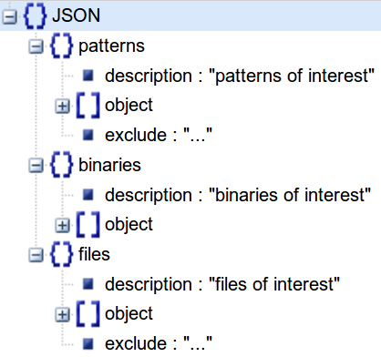
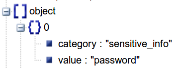

# static-firmware-analysis

[](https://github.com/secjey/static-firmware-analysis/issues)

## Installation

```sh
$ git clone https://github.com/secjey/static-firmware-analysis
$ cd static-firmware-analysis 
$ pip install -r requirements.txt
```

## Usage

```
$ python static_analysis.py --help
	
usage: static_analysis.py [-h] [-o OUTPUT_FILE] [--rules JSON_FILE] filesystem

DESCRIPTION

positional arguments:
  filesystem            Path to the extracted filesystem directory

optional arguments:
  -h, --help            show this help message and exit
  -o OUTPUT_FILE, --output OUTPUT_FILE
                        Path to the output file which contains all information
  --rules JSON_FILE     Path to the file containing the rules in JSON format
```

By default, the output will be displayed in the console, but it will only contain X matches for each object (shortened version). In the case there are more results, a `...` will be added. This is useful to have a quick overview. In the case you want to see all information (full version), you need to provide a path for the output file.

### Output

The output information will be displayed as follows:

| CATEGORY | DATA TYPE | NAME | OUTPUT
| :---: | --- | --- | --- |
| [`category`](#category) | "patterns" \| "binaries" \| "files" | [`name`](#name) (if defined) and [`value`](#value) | File or data that matches the rule defined by [`value`](#value)
| * | ... | ... | 1st match<br>2nd match<br>3rd match
| Other [`category`](#category) | ... | ... | ...
| * | ... | ... | ...

## Demo

[](https://asciinema.org/a/131575)

## Rules

Thanks to the rules defined in a JSON format, users can customize their search according to their needs. You can easily edit the `rules.json` file with a [JSON editor](http://www.jsoneditoronline.org).

### JSON structure

The current JSON structure to describe the user-defined rules is as follows:



In each category (i.e. `patterns`, `binaries` and `files`), there is a list of objects that can contain multiple [keys](#keys) such as `category` and `value`:



### <a id="keys">Keys</a>

* For `patterns`, `binaries` and `files` objects:
    * <a id="category">`category`</a> (**mandatory**): Its value describes the category the object belongs to (e.g. script, sensitive info, webserver, ...).
    * <a id="value">`value`</a> (**mandatory**): This is the string, regexp or file you want to look for.
    * <a id="name">`name`</a> (optional): This is the key to add a meaningful name to your regexp. If this key is defined, it will be displayed in the output alongside the `value`.
    * `exclude` defined locally (optional): Its value will be excluded from the search for the specific object only. For instance, defining `"exclude": "html,js"` alongside `"value": "admin"` in an object will exclude every html _and_ js file that might contain the value "admin".
    * `exclude` defined globally (optional): Its value will be excluded from the search for every object in the list of objects.
    * `include` defined locally (optional): Its value will be included to the search. This is useful if you would like to globally exclude a file type but still include it for a specific object. In the case a value is locally excluded and locally included at the same time, the value will be _included_.

* For `patterns` objects only:
    * `print_match` (optional): By default, the output will only display the file that contains the data. You can change this behaviour by adding a key `"print_match": true` to display the exact match instead. This is particularly useful for regexp where you want to extract information such as URLs, e-mails and the like.

### Values

Using the value `binary` for the keys `exclude` or `include` in `patterns` will exclude/include binary files in the search.

## Contributing

All your bug reports and feature ideas are highly appreciated, thanks in advance! 

If you would like to contribute but you don't know what to implement, here is the task list:

### Tasks

- [ ] Add support for the keys `exclude-dir` and `include-dir` to exclude/include directories
- [ ] Write a unittest with pytest
- [ ] Add other `rules.json` templates to meet specific requirements (e.g. specific vendor)
- [x] Update the README

## License

>You can check out the full license [here](https://github.com/secjey/static-firmware-analysis/blob/master/LICENSE)

This project is licensed under the terms of the **GPLv3** license.
